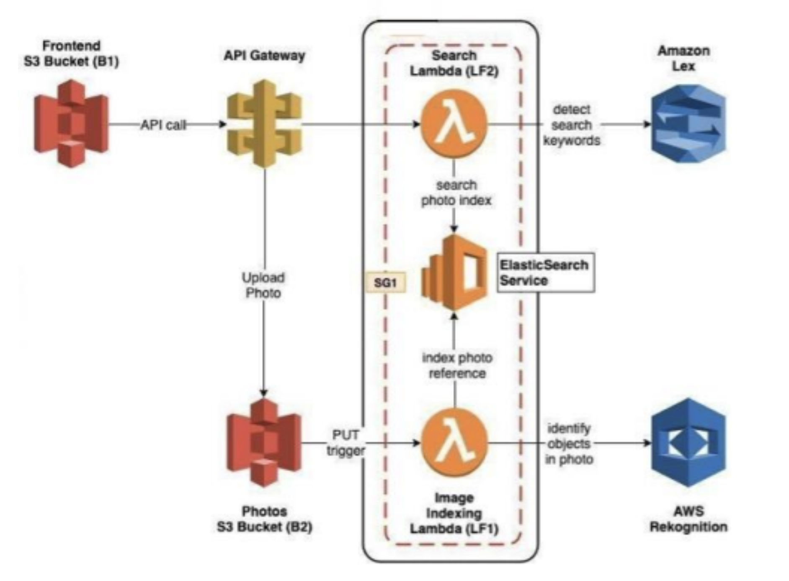

# Photo Album Web Application with Intelligent Search

## Video Demo
))

[Watch the Demo Video]([https://www.example.com/demo-video](https://youtu.be/2seHHt7JHSc))
## Overview

This project is a **Photo Album Web Application** that enables users to upload photos and search through them using **natural language queries**. By utilizing **AWS AI and serverless technologies**, the application intelligently indexes photos based on detected objects, people, actions, and landmarks. Users can search for photos with specific keywords or phrases like _"show me photos with trees and birds."_.

## Features

- **Photo Upload**: Users can upload photos with custom labels.
- **Automated Indexing**: Photos are analyzed using **Amazon Rekognition** to detect objects and actions, and metadata is stored in **Amazon ElasticSearch** for fast searching.
- **Natural Language Search**: Queries are processed using **Amazon Lex** to interpret user intent and return relevant photos.
- **Responsive Frontend**: A simple, user-friendly interface to upload photos and view search results.

## Key Technologies

### AWS Services
- **Amazon S3**: For storing uploaded photos and hosting the frontend.
- **AWS Lambda**: For serverless processing, including indexing and search logic.
- **Amazon Rekognition**: For detecting labels (objects, scenes, and activities) in photos.
- **Amazon ElasticSearch**: For indexing and querying photo metadata.
- **Amazon Lex**: For natural language understanding of search queries.
- **Amazon API Gateway**: For creating a RESTful API to interact with the application.

### Infrastructure as Code
- **AWS CloudFormation**: For provisioning and managing the infrastructure, including Lambda functions, API Gateway, S3 buckets, and permissions.
- **AWS CodePipeline**: For automating the deployment of Lambda functions and the frontend.

### Frontend
- **Static Website**: Built and hosted using S3 with static website hosting enabled.
- **API Integration**: Utilizes the SDK generated by API Gateway for seamless interaction with backend services.

## How It Works

1. **Photo Upload**:
   - Users upload photos via the frontend or API.
   - Custom labels can be specified during upload.
   - Metadata and Rekognition-detected labels are indexed into ElasticSearch.

2. **Search**:
   - Users search using natural language queries via the frontend.
   - The search request is processed by Lex to extract keywords.
   - ElasticSearch is queried to find and return matching photos.

3. **Frontend**:
   - Displays search results dynamically.
   - Allows users to upload new photos with custom labels.

## Deployment

The application is deployed using AWS services, with automation provided by **AWS CodePipeline**. The deployment includes:
- **Frontend**: Static website hosted on an S3 bucket.
- **Backend**: Lambda functions, API Gateway, and ElasticSearch for processing requests and serving data.

---

This project demonstrates the power of serverless architecture and AI-based search capabilities using AWS, providing a robust and scalable solution for managing and searching photo albums.
